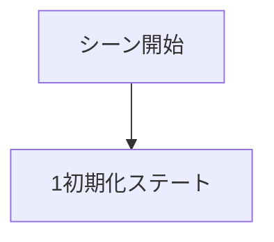
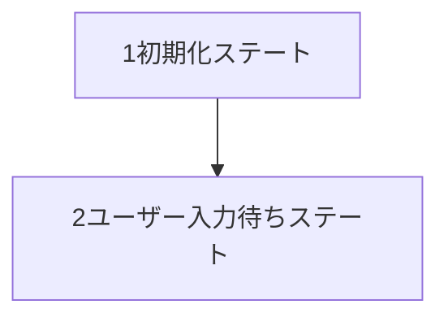
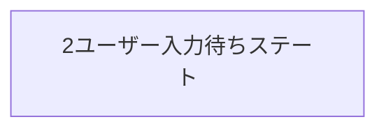
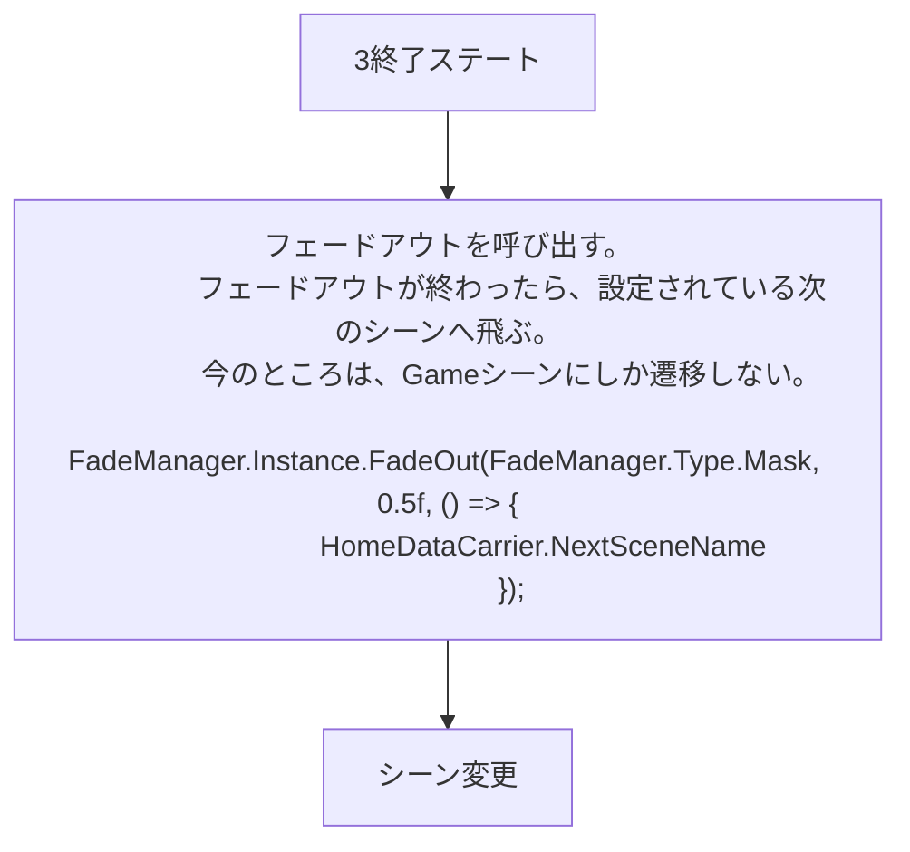
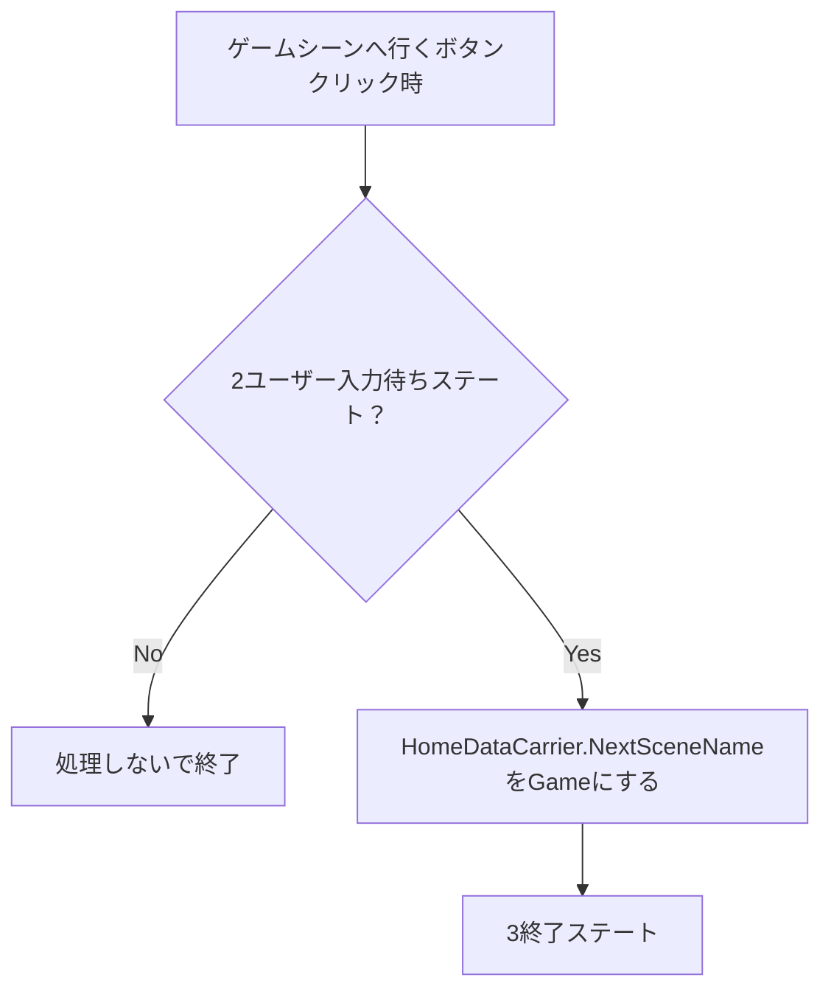
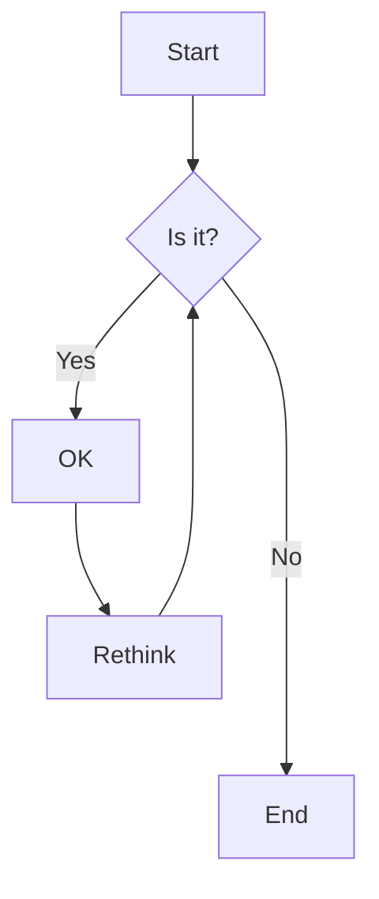

# ホームシーン
## HomeScene

```mermaid
flowchart TD
    HomeScene[シーン開始] --> HomeInitializeState[1初期化ステート];
```

## HomeInitializeState

```mermaid
flowchart TD
    HomeInitializeState[1初期化ステート] --> HomeUserWaitState[2ユーザー入力待ちステート];
```

## HomeUserWaitState

```mermaid
flowchart TD
	HomeUserWaitState[2ユーザー入力待ちステート];
```

## HomeEndState

```mermaid
flowchart TD
	HomeEndState[3終了ステート] --> FadeOut["
		フェードアウトを呼び出す。
		フェードアウトが終わったら、設定されている次のシーンへ飛ぶ。
		今のところは、Gameシーンにしか遷移しない。
		FadeManager.Instance.FadeOut(FadeManager.Type.Mask, 0.5f, () => {
			HomeDataCarrier.NextSceneName
		});
	"];
	FadeOut --> SceneChange[シーン変更];
```

## HomeScene_OnClickGoToGameScene

```mermaid
flowchart TD
	OnClickGoToGameScene[ゲームシーンへ行くボタンクリック時] --> StateCheck{"2ユーザー入力待ちステート？"};
	StateCheck -- No --> Block1[処理しないで終了];
	StateCheck -- Yes --> Block2["
		HomeDataCarrier.NextSceneNameをGameにする
	"];
	Block2 --> HomeEndState[3終了ステート];
```

## 小題2

```mermaid
flowchart TD
    A[Start] --> B{Is it?};
    B -- Yes --> C[OK];
    C --> D[Rethink];
    D --> B;
    B -- No ----> E[End];
```
